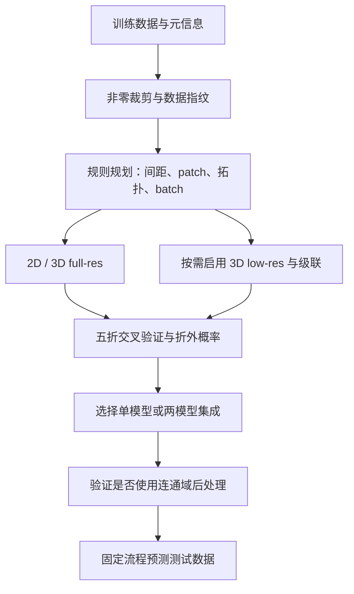

# nnU-Net 论文学习与 PyTorch 参考实现

## 1. 论文信息

| 项目 | 内容 |
| --- | --- |
| 标题 | **nnU-Net: a self-configuring method for deep learning-based biomedical image segmentation** |
| 作者 | Fabian Isensee、Paul F. Jaeger、Simon A. A. Kohl、Jens Petersen、Klaus H. Maier-Hein |
| 期刊 | Nature Methods，18，203–211 |
| 年份 | 2021 |
| 论文 | https://doi.org/10.1038/s41592-020-01008-z |
| 官方仓库 | https://github.com/MIC-DKFZ/nnUNet |
| 对照版本 | [nnU-Net v1 分支](https://github.com/MIC-DKFZ/nnUNet/tree/nnunetv1) |

本目录以所提供的 Nature Methods 论文及其 Methods 为依据。它不是 2015 年原版 U-Net，也不将后来 nnU-Net v2 的新默认设置归入本论文。代码用于逐模块理解论文，**不声称复现论文的竞赛指标，也不与官方 checkpoint 兼容**。

## 2. 简介与核心思想

医学数据的模态、体素间距、图像大小和类别比例差别很大。仅更换一个网络模块，未必比正确设置预处理、patch 大小、训练策略和推理过程更有效。

nnU-Net 把整个分割方案的配置分成三组：

| 参数类别 | 从哪里来 | 典型内容 |
| --- | --- | --- |
| Fixed parameters | 在多种任务上总结的固定设置 | plain U-Net 模板、InstanceNorm、LeakyReLU、Dice+CE、优化器 |
| Rule-based parameters | 数据指纹与硬件预算，通过规则推导 | 重采样间距、卷积核、降采样轴、网络深度、patch、batch、是否启用级联 |
| Empirical parameters | 训练集五折交叉验证 | 选择模型或两个模型的集成，是否保留最大连通域 |

**Dataset fingerprint** 描述数据；**pipeline fingerprint** 描述据此生成的整套方案。`NNUNet(...)` 只是其中的网络模板，自动配置由其他模块实现。

论文在 23 个公开数据集、53 个分割任务上评估，其中十个 Medical Segmentation Decathlon 数据集用于开发方法，另外十三个数据集用于考察泛化。论文报告的结果不等于本目录代码已经训练得到的结果。

## 3. 整体流程与文件分工



| 文件 | 核心作用 |
| --- | --- |
| `README.md` | 论文信息、公式、数据流、形状、差异与使用说明 |
| `blocks.py` | 展开 Conv → InstanceNorm → LeakyReLU，两次卷积 |
| `model.py` | 2D/3D 编解码器、步幅卷积、转置卷积、拼接与深监督头 |
| `planning.py` | target spacing、各向异性拓扑、patch/batch 联动、级联触发与低分辨率规划 |
| `preprocessing.py` | 数据指纹、非零裁剪、CT/非 CT 归一化、重采样和预测还原 |
| `losses.py` | Dice+CE、深监督、多项式学习率、前景 patch 数量 |
| `cascade.py` | 把第一阶段预测转换为第二阶段的附加输入 |
| `inference.py` | 滑窗、Gaussian 加权、镜像增强、2D 逐切片预测 |
| `selection.py` | 用折外结果选择模型集成与连通域规则 |
| `export_onnx.py` | **单独的 ONNX 导出文件**，可导出 2D 或 3D 示例 |

阅读顺序建议：`blocks.py` → `model.py` → `losses.py` → `preprocessing.py` → `planning.py` → `cascade.py` → `inference.py` → `selection.py`。

## 4. 数据指纹与预处理

### 4.1 数据指纹

`dataset_fingerprint` 记录裁剪前后尺寸、spacing、模态、类别数、病例数、类别比例，以及每个模态在训练集前景体素中的均值、标准差、0.5% 和 99.5% 分位数。

输入病例的格式为 `{"image": image, "label": label, "spacing": spacing}`：图像为 `[C,D,H,W]`，标签为 `[D,H,W]`，标签值为 `0 ... K-1`，背景为 0。`C` 可以是多个成像模态，不一定是 RGB。空间维和 spacing 必须逐轴对应；本代码不读取 NIfTI 的方向矩阵或自动重新定向。

非零裁剪使用所有模态非零区域的并集，保存 bounding box，以便最终恢复原尺寸。填充掩膜内部孔洞属于实现补全。常规示例假定病例存在非零图像区域，且整个训练集存在前景标注。

### 4.2 强度归一化

CT 使用训练集前景统计，在所有病例中共用同一组统计量：

$$
x'=\frac{\operatorname{clip}(x,q_{0.5},q_{99.5})-\mu_{\mathrm{fg}}}{\sigma_{\mathrm{fg}}}.
$$

非 CT 默认逐病例、逐模态进行 z-score：

$$x'=\frac{x-\mu_{\mathrm{case}}}{\sigma_{\mathrm{case}}}.$$

如果非零裁剪平均使体积减少至少 25%，非 CT 的统计与归一化限制在非零掩膜内。CT 的均值和标准差从原始前景值统计，随后对图像先裁剪再归一化。代码中的微小分母下限只是避免常数图像除零。

### 4.3 重采样

按实际物理间距计算新尺寸：

$$n'_i=\operatorname{round}\left(n_i\frac{s_i}{s'_i}\right).$$

| 内容 | 一般情况 | 各向异性情况 |
| --- | --- | --- |
| 图像强度 | 三阶样条 | 平面内三阶样条，粗轴最近邻 |
| 标签 | one-hot 后逐类线性插值，再 argmax | 平面内线性插值，粗轴最近邻 |

这里使用 SciPy 表达样条和连通域等非网络操作；网络与损失使用真实 PyTorch API。不能把整数类别图直接进行三阶或线性插值，否则会创造无意义的类别数值。

重采样的各向异性阈值是 spacing 比值 **>3**；网络核和降采样规则使用的阈值是 **2**。不要混淆这两个判断。

推理时先将预测概率恢复到裁剪后的原始网格，再 `argmax`，最后放回原始 bounding box；外部区域填背景。2D 处理 3D 病例时，只重采样两个平面内的轴，切片轴保留每个病例自己的原始 spacing。

## 5. 自动规划规则

### 5.1 Target spacing

3D full-res 默认逐轴取训练病例 spacing 的中位数。最低物理分辨率轴即 spacing 最大的轴；当它同时体现明显的 spacing 与体素数量各向异性时，改取该轴 spacing 的第 10 百分位数。

`target_spacing` 将这个条件具体写成：粗轴 spacing 大于其余轴最大 spacing 的三倍，且粗轴体素数小于其余轴最小体素数的三分之一。这是对 Methods 的明确代码化解释；边界判断不声称与任意官方版本逐行一致。

2D 使用物理分辨率最高的两个轴；完全各向同性时，`argmax` 选择第一个轴作为切片轴，剩余两个轴是末两轴。

### 5.2 卷积核与降采样轴

网络深度不是固定的。`configure_topology` 联合考虑 patch 与 spacing：

1. 默认卷积核为 `3×3` 或 `3×3×3`。
2. 3D 粗轴初期可使用 `1`，例如 `(1,3,3)`，避免过早混合层间信息。
3. 先降采样高分辨率轴，例如 stride `(1,2,2)`；当有效 spacing 相差不超过两倍时，再对相关轴一起降采样。
4. 单个轴继续降采样会小于 4 个体素时，停止对这个轴降采样。
5. 某轴的卷积核升为 3 后保持为 3。

### 5.3 Patch、batch 与预算

初始 patch 为重采样后的病例尺寸中位数，向上补齐为各轴总降采样倍数的整数倍。如果 batch=2 的规模超过预算，则沿“当前 patch 尺寸 / 中位病例尺寸”最大的可缩小轴减小 patch，并重新计算拓扑。每步减小该轴当前的总降采样倍数。

预算足够时，可提高 batch；否则优先保留 batch=2 和尽可能大的 patch。一个 batch 的总体素量还受到训练集总体素量 5% 的限制。对于极小数据集，两条约束冲突时，本实现明确优先保留 batch≥2。

**本目录最主要的参考实现边界是显存估算。**论文用特征图规模对照实测显存参考值；本代码展开特征元素累计，但没有冒充论文附录的具体标定常数。`feature_budget_2d` / `feature_budget_3d` 的单位是特征元素代理值，不是字节，也不是 GB。必须在实际硬件、精度和训练设置下标定，不能直接填写 `16` 代表 16 GB。

### 5.4 3D 级联配置

定义覆盖比例为 patch 的体素数除以重采样后中位病例的体素数，**不是某条边长的比例**。

- full-res patch 覆盖比例 `<12.5%` 时，考虑启用级联。
- 逐步将 spacing 增加 1%，每次重规划 low-res 网络与 patch，直到覆盖比例 `>25%`。
- 当前 spacing 各向异性超过两倍时，先增加高分辨率轴的 spacing。
- 第二阶段沿用 full-res 几何结构，将第一阶段预测作为额外输入。

`plan_experiment` 返回 `2d`、`3d_fullres`，并按需增加 `3d_lowres`、`3d_cascade_fullres`。级联第二阶段输入通道更多，实际训练前仍需复核显存。

## 6. 网络模板与 Forward 数据流

网络使用普通 U 形编码器和解码器，没有加入残差、密集连接、注意力、SE 或空洞卷积。

每个分辨率执行两次：

$$h=\operatorname{LeakyReLU}(\operatorname{InstanceNorm}(\operatorname{Conv}(x))).$$

`InstanceNorm` 对每个样本、每个通道，独立统计所有空间位置：

$$\hat{x}_{b,c}=\gamma_c\frac{x_{b,c}-\mu_{b,c}}{\sqrt{\sigma^2_{b,c}+\epsilon}}+\beta_c.$$

LeakyReLU 的负半轴斜率为 0.01。初始通道数为 32，每次降采样翻倍，2D 上限 512，3D 上限 320。

编码器通过第一个卷积的 stride 降采样；解码器通过转置卷积上采样，然后与同分辨率编码器特征沿 channel 维拼接：

$$d_i=\operatorname{TwoConv}\left(\operatorname{Concat}\left(e_i,\operatorname{UpConv}(d_{i+1})\right)\right).$$

`torch.cat(..., dim=1)` 保留两路通道信息，不是 ResNet 的残差相加。这里使用保持尺寸的 padding，且输入可被总 stride 整除，因此无需原版 U-Net 的 copy-and-crop。

### 6.1 2D 示例形状

对应 `export_onnx.py` 的固定示例，输入通道为 1，包含背景共 3 类：

| 步骤 | Tensor shape | 核心操作 |
| --- | --- | --- |
| 输入 | `[B,1,128,128]` | 图像 |
| Encoder 0 | `[B,32,128,128]` | 两个卷积块 |
| Encoder 1 | `[B,64,64,64]` | 第一个卷积 stride=2 |
| Encoder 2 | `[B,128,32,32]` | stride=2 |
| Bottleneck | `[B,256,16,16]` | stride=2 |
| Up 2 / concat | `[B,128,32,32]` / `[B,256,32,32]` | 与 Encoder 2 拼接 |
| Decoder 2 | `[B,128,32,32]` | 两个卷积块；不加监督头 |
| Up 1 / concat | `[B,64,64,64]` / `[B,128,64,64]` | 与 Encoder 1 拼接 |
| Decoder 1 | `[B,64,64,64]` | 辅助 logits `[B,3,64,64]` |
| Up 0 / concat | `[B,32,128,128]` / `[B,64,128,128]` | 与 Encoder 0 拼接 |
| Decoder 0 | `[B,32,128,128]` | 主 logits `[B,3,128,128]` |

这里共有四个尺度；最粗的两个尺度为 `16×16` 和 `32×32`，不参与辅助监督。主输出永远保留。`deep_supervision=True` 返回 `(最高分辨率 logits, 次高分辨率 logits, ...)`；`False` 只返回主 logits。

### 6.2 3D 示例形状

导出脚本的 3D 示例使用输入 `[B,1,16,64,64]`：

| 编码层 | kernel | stride | 输出 |
| --- | --- | --- | --- |
| 0 | `(1,3,3)` | `(1,1,1)` | `[B,32,16,64,64]` |
| 1 | `(3,3,3)` | `(1,2,2)` | `[B,64,16,32,32]` |
| 2 | `(3,3,3)` | `(2,2,2)` | `[B,128,8,16,16]` |
| 3 | `(3,3,3)` | `(2,2,2)` | `[B,256,4,8,8]` |

解码器逆转对应 stride，主 logits 为 `[B,3,16,64,64]`。这些只是可读的结构示例，不代表 nnU-Net 只有一种固定拓扑。

## 7. 训练目标与公式对应

### 7.1 Dice + Cross-Entropy

对类别维 softmax，`p = logits.softmax(dim=1)`。CE 使用 `F.cross_entropy(logits, target)`，不需要先把 softmax 结果传进去。

$$L_{\mathrm{CE}}=-\frac{1}{N}\sum_x\log p_{y_x}(x),$$

$$D_c=\frac{2\sum_xp_c(x)y_c(x)+\epsilon}{\sum_xp_c(x)+\sum_xy_c(x)+\epsilon},$$

$$L=L_{\mathrm{CE}}+1-\frac{1}{K-1}\sum_{c=1}^{K-1}D_c.$$

代码的 one-hot、逐元素乘法、`sum` 对应交集和分母。Dice 排除背景，CE 保留背景；平滑量取 `1e-5`。这些具体数值与聚合约定属于实现补全。`batch_dice=False` 时逐病例计算，`True` 时额外将 batch 维一起求和。使用 `1-Dice` 相比 `-Dice` 只加常数，不改变梯度。

此参考实现假定标签完整、类别互斥；没有增加 ignore-label、重叠区域编码或部分标注支持。

### 7.2 深监督

$$L_{\mathrm{total}}=\sum_{i=0}^{S-1}w_iL_i,\qquad w_i=\frac{2^{-i}}{\sum_{j=0}^{S-1}2^{-j}}.$$

网络只提供参与监督的尺度。标签使用最近邻缩放到每个输出的尺寸，再独立计算 Dice+CE。例如上面的两个输出权重为 `2/3`、`1/3`。推理只需要最高分辨率输出。

### 7.3 学习率与采样

$$\eta(e)=0.01\left(1-\frac{e}{1000}\right)^{0.9}.$$

论文使用 SGD、Nesterov momentum=0.99，训练 1,000 epochs，每个 epoch 定义为 250 个 mini-batches。这里 epoch 不等于把全部训练图片遍历一次。

约 66.7% 的 patch 随机采样，约 33.3% 保证包含某个前景类别，且至少一个前景 patch；batch=2 时就是一个随机 patch、一个前景 patch。`foreground_patch_count` 只表达数量规则，具体 patch 提取和 DataLoader 按 request.md 省略。

正文列出的增强包括旋转、缩放、Gaussian noise/blur、亮度、对比度、模拟低分辨率、gamma 和镜像。本附件没有 Supplementary Note 4 中完整的概率与幅度，本目录记录这些策略，不虚构一套“论文精确参数”，也不引入整套增强训练工程。

## 8. 级联与推理

`make_cascade_input` 将 low-res 概率恢复到 full-res 网格，取 `argmax` 后转换为前景 one-hot，移除背景通道，再与原图拼接。如果原图有 `C` 个通道、分割有 `K` 类，第二阶段输入为 `C+K-1` 个通道。

第一阶段和第二阶段分别训练。训练第二阶段需要第一阶段的**折外预测**；不能直接输入真实标签，也不能让第一阶段先见过该病例再用其拟合内预测替代折外结果。`detach()` 明确切断跨阶段梯度。论文只描述拼接预测分割，前景 one-hot 的表示和 trilinear 恢复是实现补全；极强各向异性数据可接入预处理模块的分轴重采样。

滑窗大小等于训练 patch，相邻窗口约有半个 patch 的重叠。镜像增强对所有空间轴组合进行预测，并把预测翻转回原坐标。2D 有最多 4 个组合，3D 有最多 8 个组合。

$$P(x)=\frac{\sum_tG_t(x)P_t(x)}{\sum_tG_t(x)}.$$

代码先累加 `probability * importance`，再除以权重和。应平均 softmax 概率，不能先 `argmax` 再把类别编号求平均。Gaussian 的标准差取 patch 轴长的 1/8，并使用小的正数下限，这是明确的实现补全。

`predict_volume_with_2d` 将三维病例按选择的切片轴逐层交给 2D 网络，再还原轴顺序。2D 和 3D 结果需要先对齐到同一病例物理网格，才能集成。

## 9. 模型选择与后处理

`select_ensemble` 遍历所有单配置及两配置组合，平均各自的折外 softmax 概率，以验证病例的平均前景 Dice 选择方案。论文还将低分辨率网络作为可选候选；它不自动等于最终选中的模型。

`select_postprocessing` 先把所有前景视为一组，只保留最大的连通域；如果平均前景 Dice 提升且任何类别的 Dice 都不下降，才接受。然后在该结果基础上逐类别尝试相同规则。

不能默认所有任务都保留最大连通域：多个病灶或多个实例可能都是真的。规则确定后，测试阶段只调用 `apply_postprocessing`，不再使用测试标签挑规则。

本实现明确采用 2D 四邻接/3D 六邻接；预测与真值均为空的病例-类别组合不参与均值。这些是评估与连通性的补全约定。

## 10. 与经典方法的区别

| 方面 | 2015 U-Net | 本论文 nnU-Net |
| --- | --- | --- |
| 主要贡献 | U 形网络、跳跃连接、少样本医学分割 | 整套流程自动配置与系统化经验规则 |
| 结构 | 图中固定 2D 示例 | 从同一模板推导不同 2D/3D 拓扑 |
| 卷积边界 | valid 卷积，需要 crop | 本实现采用保持尺寸的 padding |
| 激活与归一化 | ReLU，图中无 IN | InstanceNorm + LeakyReLU(0.01) |
| 降采样 | MaxPool | Strided convolution |
| 训练目标 | 像素加权交叉熵 | Dice+CE、多尺度深监督 |
| 尺度与间距 | 主要面向二维显微图像 | 依据 spacing 处理各向异性体积 |
| 最终方案 | 预先指定网络 | 交叉验证选择配置、集成和后处理 |

与 SMP 的 `Unet(encoder_name=...)` 相比，仅建立一个网络对象并没有完成 nnU-Net 的数据指纹、自动规划、训练和模型选择过程。与纯搜索式 NAS 相比，本论文把大量决策写成规则，只把少数选择留给经验验证。

## 11. 使用示例

在本目录运行，或直接运行其中的脚本。因为目录名带数字与连字符，不要写 `from 07-nnUNet import ...`。

```bash
cd 07-nnUNet
pip install torch numpy scipy onnx onnxscript
```

最小前向传播与损失：

```python
import torch
from model import NNUNet
from losses import deep_supervision_loss

model = NNUNet(
    in_channels=1,
    num_classes=3,
    kernel_sizes=[(3, 3)] * 4,
    strides=[(2, 2)] * 3,
)
x = torch.randn(2, 1, 128, 128)
target = torch.randint(0, 3, (2, 128, 128))
outputs = model(x)
# [2,3,128,128] 和 [2,3,64,64]
loss = deep_supervision_loss(outputs, target)
loss.backward()

model.deep_supervision = False
model.eval()
with torch.no_grad():
    logits = model(x)
    prediction = logits.argmax(dim=1)  # [2,128,128]
```

模型连接自动规划结果的方式：

```python
from preprocessing import dataset_fingerprint
from planning import plan_experiment

# cases 为训练病例字典列表；预算需按自己的硬件与训练配置实测标定。
fingerprint = dataset_fingerprint(cases, modalities=["MRI"], num_classes=3)
plans = plan_experiment(fingerprint, feature_budget_2d=2e7, feature_budget_3d=4e7)
p = plans["3d_fullres"]
model = NNUNet(p["in_channels"], p["num_classes"], p["kernel_sizes"], p["strides"])
# 数据预处理、patch 提取必须使用同一个 p["spacing"] 和 p["patch_size"]。
```

这里 `2e7`、`4e7` 只是演示预算接口，不是论文硬件标定结果。

### 独立导出 ONNX

```bash
python export_onnx.py
```

默认生成脚本同目录下的 `nnunet_2d.onnx`，输入 `[1,1,128,128]`，输出 `[1,3,128,128]`。打开 Netron 即可查看；把脚本顶部 `DIM=2` 改为 `DIM=3`，则生成 `nnunet_3d.onnx`，输入 `[1,1,16,64,64]`，输出 `[1,3,16,64,64]`。

脚本单独保存在 `export_onnx.py`，使用 `torch.onnx.export`，显式设置 `dynamo=True`、opset 18 和 `external_data=False`，并调用 ONNX checker。输入尺寸固定，没有声称支持任意动态尺寸。若修改 `IN_CHANNELS` 或 `NUM_CLASSES`，输入/输出随之变化；如有训练权重，需在导出前载入匹配的 state_dict。

ONNX 文件只含配置好的单网络推理图，不包含数据分析、预处理、五折训练、滑窗外层循环或经验选择。导出时关闭深监督，并使用随机权重供结构学习。实际生成的二进制不纳入本次源码提交。

## 12. 论文明确内容、补全与范围

| 项目 | 处理方式 |
| --- | --- |
| 网络基本算子、0.01 负斜率、32 初始通道、320/512 通道上限 | 按论文 Methods |
| 深监督尺度、权重衰减、Dice+CE、poly、SGD 配置 | 按正文规则展开；具体 Dice 聚合和平滑项另行注明 |
| anisotropy、spacing、patch/batch、级联阈值 | 展开正文中的规则；边界解释与显存代理明确标注 |
| padding、IN affine/eps、bias、权重初始化 | PyTorch/常见实现补全；初始化使用 PyTorch 层默认值，不冒充论文精确设置 |
| Gaussian sigma、体素中心坐标、边界扩展、连通性 | 明确的参考实现选择 |
| 网络层内通道分配 | 按正文的逐尺度倍增/递减直接实现；不保证与官方每个 bottleneck 内部张量完全同构 |
| 预处理强度统计 | 为教学拼接全部前景值，未实现大数据的流式统计 |
| 训练工程 | 按 request.md 省略 DataLoader、完整循环、checkpoint、分布式与 CLI |
| 增强 | 记录正文策略；附件未含完整 Supplementary Note 4，不伪造精确增强配置 |
| 实验与性能 | 验证实现、形状、梯度和导出，不把合成输入检查称为数据集复现 |

## 13. 阅读心得

这篇论文适合在掌握 U-Net 后阅读。真正需要理解的是：为什么某个数据集应该选择这样的 spacing、patch 和网络深度，以及这些选择怎样互相制约。比较模型时应同时控制预处理、训练、采样和评估设置，否则很容易把流程差异误认为结构创新的效果。

对于二维分割学习，可以先读网络、损失和滑窗；对于 ACDC 等三维医学数据，再重点理解物理 spacing、2D 逐切片与 3D 体积输入、各向异性卷积，以及患者级交叉验证。一个切片的 `[C,H,W]` 和一个病例的 `[C,D,H,W]` 是不同的数据单位。

## 14. 资料

- [论文 DOI 与期刊信息](https://doi.org/10.1038/s41592-020-01008-z)：本目录正文和 Methods 的主要依据为用户提供的 PDF。
- [官方 nnU-Net 仓库](https://github.com/MIC-DKFZ/nnUNet)及其 [v1 分支](https://github.com/MIC-DKFZ/nnUNet/tree/nnunetv1)：研究真实训练和历史实现时使用，注意版本差异。
- [PyTorch ONNX 文档](https://docs.pytorch.org/docs/stable/onnx.html)：导出 API 与依赖。

## 15. 本次验证记录

CPU 验证环境：Python 3.12、PyTorch 2.14.1+cpu、ONNX 1.23.1、ONNX Runtime 1.30.0。

- 2D 与各向异性 3D 前向形状正确；多尺度损失与反向传播通过。
- 自动规划产生的 patch 可被总 stride 整除，并可真正送入对应网络；检查了级联触发与低分辨率覆盖率。
- 合成病例的非零裁剪、CT/非 CT 归一化、各向异性标签重采样与原尺寸还原通过。
- 用逐像素已知模型检查滑窗边缘覆盖、padding、Gaussian 拼接、全部镜像组合，以及三个可能的 2D 切片轴。
- 检查了级联的前景 one-hot 通道和梯度截断，以及折外集成选择、验证驱动的小连通域移除。
- 实际导出 2D、3D ONNX 并通过 checker；用相同权重和输入对比 ONNX Runtime 与 PyTorch，最大绝对误差分别约为 `1.79e-6`、`3.46e-6`。

这些检查验证计算实现，不包括真实医学数据训练、官方权重对齐或论文指标重现。
