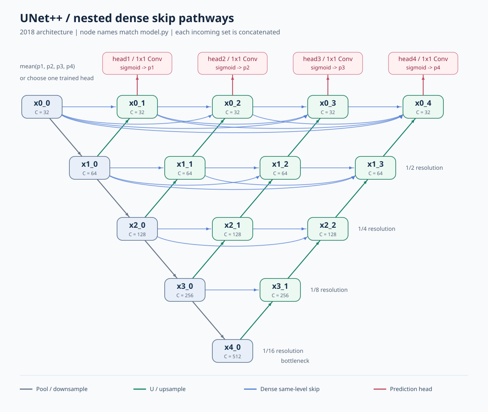

# UNet++：嵌套 U-Net 论文学习与 PyTorch 参考实现

## 1. 论文信息与本目录范围

| 项目 | 内容 |
| --- | --- |
| 标题 | **UNet++: A Nested U-Net Architecture for Medical Image Segmentation** |
| 作者 | Zongwei Zhou、Md Mahfuzur Rahman Siddiquee、Nima Tajbakhsh、Jianming Liang |
| 机构 | Arizona State University |
| 年份 | 2018 |
| 发表 | MICCAI 2018 配套 DLMIA / ML-CDS 研讨会论文集，LNCS 11045，pp. 3–11；不是 MICCAI 主会议论文 |
| 本次阅读版本 | 用户提供的 8 页 `UNet++.pdf`，即 arXiv:1807.10165v1 |
| 论文链接 | [arXiv v1](https://arxiv.org/abs/1807.10165v1) · [出版信息](https://link.springer.com/chapter/10.1007/978-3-030-00889-5_1) |
| 作者代码 | [UNetPlusPlus](https://github.com/MrGiovanni/UNetPlusPlus) · [Keras 节点与网络实现](https://github.com/MrGiovanni/UNetPlusPlus/blob/master/keras/helper_functions.py) |

这是一份帮助阅读论文的参考实现，核心是图 1 的嵌套密集连接、式 (1) 的节点计算、式 (2) 的损失、深监督以及推理分支选择。没有数据集、训练循环、优化器、CLI 或预训练权重，也没有复现论文完整的实验成绩。

目录使用可直接作为 Python 包导入的名称 `UNetPlusPlus`。内容针对上述 **2018 年论文**，不把后续期刊扩展版的额外实验或配置混入本次实现。

## 2. 论文简介与核心思想

普通 U-Net 把编码器中分辨率较高的特征直接交给解码器拼接。两侧虽然空间尺寸可以对齐，但编码器特征偏向边缘、纹理，解码器特征通常包含更多高层语义。

UNet++ 的出发点是：**在跳跃路径中逐步处理、融合特征，再与解码器特征结合。** 作者认为这样可以缩小语义差距，让优化更容易。这是论文的建模假设与实验解释，不是对所有数据集的数学保证。

三个关键变化：

1. **嵌套路径**：浅层节点也接收下一层上采样结果，形成不同深度的解码路径。
2. **密集连接**：一个节点接收同一分辨率下此前所有节点的特征，使用通道拼接。
3. **深监督**：顶层四个节点分别输出分割结果、分别接受标签监督；推理时可以平均结果，也可以选择一个分支。

“密集”指同一行的历史特征都参与拼接，不表示每个节点连接全网络所有节点。它也不是 ResNet 的逐元素相加。

## 3. 模型整体结构



图按论文图 1 的依赖关系重绘；节点命名与 `model.py` 完全对应。灰色为下采样，绿色为上采样，蓝色为同层密集连接，红色为预测头。连向同一节点的输入先 `torch.cat`，再进入 `ConvBlock`。

用 $x^{i,j}$ 表示节点 $X^{i,j}$ 的输出：

- $i$ 是分辨率层级；越大，特征图越小。
- $j$ 是该行跳跃路径中的位置；$j=0$ 是编码器。
- 本文网络满足 $0\le i\le4$、$0\le j\le4-i$，一共 15 个特征节点。
- `x0_3` 就是 $x^{0,3}$，不是张量切片。

| 层级 | 特征节点 | 默认通道数 | 相对输入的空间尺寸 |
| --- | --- | ---: | --- |
| $i=0$ | `x0_0, x0_1, x0_2, x0_3, x0_4` | 32 | $H\times W$ |
| $i=1$ | `x1_0, x1_1, x1_2, x1_3` | 64 | $H/2\times W/2$ |
| $i=2$ | `x2_0, x2_1, x2_2` | 128 | $H/4\times W/4$ |
| $i=3$ | `x3_0, x3_1` | 256 | $H/8\times W/8$ |
| $i=4$ | `x4_0` | 512 | $H/16\times W/16$ |

同一行节点的**输出**通道数相同，拼接前的输入通道数则会随 $j$ 增长。`x4_0` 是空间分辨率最低的 bottleneck；名字描述其位置与信息压缩作用，并不意味着它必须使用 ResNet 的 Bottleneck 模块。

## 4. 模块作用与实现选择

| 模块 | 代码位置 | 主要作用 |
| --- | --- | --- |
| `ConvBlock` | `blocks.py` | 两次 `3×3 Conv -> ReLU`，把输入融合成固定通道数的节点特征 |
| 编码器 | `model.py` 的 `conv0_0` 至 `conv4_0` | 四次池化，逐级提取多分辨率特征；由各解码路径共享 |
| 上采样边 | `model.py` 的 `up0_1` 等 | 独立的 `2×2`、stride=2 转置卷积，空间放大、通道减半 |
| 嵌套融合 | `forward()` 中每个 `torch.cat` | 收集同层所有旧节点和下一层上采样节点 |
| 预测头 | `head1` 至 `head4` | `1×1 Conv`，把顶层特征映射为分割 logits |
| 深监督损失 | `losses.py` | 每个预测头独立计算损失，再汇总 |
| 推理模式 | `inference.py` | 四头概率平均，或只计算选定分支 |

**论文明确规定与实现补全需要区分：**

| 事项 | 论文明确内容 | 本实现如何处理 |
| --- | --- | --- |
| 连接拓扑 | 式 (1)、图 1 给出同层密集连接与下层上采样 | 按论文逐节点展开；编码器补写图中的池化操作 |
| 卷积核与宽度 | 跳跃路径采用 `3×3`；3D 为 `3×3×3`；$C_i=32\times2^i$ | 默认采用；`base_channels` 可缩小以便调试 |
| 节点内部卷积次数 | $\mathcal H$ 概括卷积与激活，正文没有完整逐层配置表 | 按作者 Keras `standard_unit` 补为两次卷积；不把“两次”冒称为式 (1) 的明确规定 |
| 激活、padding | 正文没有完整列出这些配置 | 采用作者实现中的 ReLU、same padding，即 PyTorch `padding=1` |
| 上下采样细节 | 图给出上下采样，未完整规定所有算子参数 | 参考作者实现，使用 max pooling 与 `kernel_size=2, stride=2` 的转置卷积 |
| 输出头 | 四个顶层节点后接 `1×1 Conv + sigmoid` | `forward` 返回 logits；损失和推理函数显式执行 sigmoid，便于稳定计算 BCE |
| 正则化、初始化 | 正文未完整规定 | 未复制作者 Keras 的 Dropout(0.5)、L2 正则与 He 初始化；采用 PyTorch 默认初始化，不添加 BatchNorm |
| 总损失 | 每个输出接受 BCE/Dice 监督 | 默认四头等权平均；规约方式、平滑常数明确标为补全 |
| 3D | 肺结节实验采用 3D，跳跃卷积为 `3×3×3` | `spatial_dims=3` 使用对应 3D 算子；各向同性池化/转置卷积是具体实现选择 |

本实现的拼接顺序按式 (1) 写成“历史节点在前，上采样节点在后”；作者 Keras 文件把上采样节点放在前面。来源拓扑等价，但通道排列不同，不能直接套用其权重文件。

## 5. 式 (1)：每个节点如何计算

论文用 $\mathcal H$ 表示卷积与激活，用 $\mathcal U$ 表示上采样，用 $[\cdot]$ 表示拼接。把图 1 中的池化和输入边界补写出来，可得到下面这个**展开版本**：

$$
x^{i,j}=
\begin{cases}
\mathcal H_{0,0}(I), & i=0,j=0,\\
\mathcal H_{i,0}(\operatorname{Pool}(x^{i-1,0})), & i>0,j=0,\\
\mathcal H_{i,j}([x^{i,0},\ldots,x^{i,j-1},\mathcal U_{i,j}(x^{i+1,j-1})]), & j>0.
\end{cases}
$$

原式的编码器分支没有把 `Pool` 单独写出来，`x0_0` 的输入边界也需要结合图理解。代码中不能因此省掉下采样。

例如 $x^{0,2}$：

```python
u0_2 = self.up0_2(x1_1)
x0_2 = self.conv0_2(torch.cat([x0_0, x0_1, u0_2], dim=1))
```

它接收 `x0_0`、`x0_1` 和 `x1_1` 上采样后的结果。`dim=1` 表示沿通道维拼接，空间尺寸必须相同。

例如 $x^{0,4}$：

```python
u0_4 = self.up0_4(x1_3)
x0_4 = self.conv0_4(
    torch.cat([x0_0, x0_1, x0_2, x0_3, u0_4], dim=1)
)
```

本实现把 $\mathcal H$ 具体化为两次卷积：

$$
\mathcal H(T)=\operatorname{ReLU}\bigl(W_2 *
\operatorname{ReLU}(W_1*T+b_1)+b_2\bigr).
$$

这里 $*$ 是卷积，不是逐元素乘法。每个节点的 $W_1,W_2,b_1,b_2$ 独立，不共享参数。

## 6. Forward 数据流与 Tensor Shape

以输入 `[B, 3, 256, 256]`、`base_channels=32`、`out_channels=1` 为例。表中 `U(x)` 已把通道数变成目标行的通道数。

| 执行顺序 | 节点 | 输入来源 | 进入 ConvBlock 的通道数 | 节点输出形状 |
| ---: | --- | --- | ---: | --- |
| 1 | `x0_0` | 输入图像 | 3 | `[B,32,256,256]` |
| 2 | `x1_0` | `Pool(x0_0)` | 32 | `[B,64,128,128]` |
| 3 | `x0_1` | `x0_0, U(x1_0)` | 64 | `[B,32,256,256]` |
| 4 | `x2_0` | `Pool(x1_0)` | 64 | `[B,128,64,64]` |
| 5 | `x1_1` | `x1_0, U(x2_0)` | 128 | `[B,64,128,128]` |
| 6 | `x0_2` | `x0_0, x0_1, U(x1_1)` | 96 | `[B,32,256,256]` |
| 7 | `x3_0` | `Pool(x2_0)` | 128 | `[B,256,32,32]` |
| 8 | `x2_1` | `x2_0, U(x3_0)` | 256 | `[B,128,64,64]` |
| 9 | `x1_2` | `x1_0, x1_1, U(x2_1)` | 192 | `[B,64,128,128]` |
| 10 | `x0_3` | `x0_0, x0_1, x0_2, U(x1_2)` | 128 | `[B,32,256,256]` |
| 11 | `x4_0` | `Pool(x3_0)` | 256 | `[B,512,16,16]` |
| 12 | `x3_1` | `x3_0, U(x4_0)` | 512 | `[B,256,32,32]` |
| 13 | `x2_2` | `x2_0, x2_1, U(x3_1)` | 384 | `[B,128,64,64]` |
| 14 | `x1_3` | `x1_0, x1_1, x1_2, U(x2_2)` | 256 | `[B,64,128,128]` |
| 15 | `x0_4` | `x0_0, x0_1, x0_2, x0_3, U(x1_3)` | 160 | `[B,32,256,256]` |

四个预测头把 `x0_1, x0_2, x0_3, x0_4` 分别变成 `[B,1,256,256]`。因此四个输出都能直接与原尺寸标签监督，不需要把标签缩成四个尺度。

一般地，本实现 $\mathcal U$ 将 $C_{i+1}$ 通道变为 $C_i$，因此：

$$
C_{\mathrm{cat}}=jC_i+C_i=(j+1)C_i.
$$

如果另一个实现只用双线性插值而不改变通道，拼接通道数就会变为 $jC_i+C_{i+1}$。不能把这两种实现的 `Conv2d(in_channels=...)` 配置混用。

**尺寸前提**：图像的 $H,W$，以及 3D 的 $D,H,W$，均为 16 的正整数倍。论文使用的 96、224、512、64 均满足。这里不添加裁剪、插值对齐或隐式 padding 分支；与原版 2015 U-Net 的 valid convolution、copy-and-crop 不同，本实现节点内部采用 same padding。

## 7. 深监督、式 (2) 与损失实现

### 7.1 四个分割头

$$
z_j=\operatorname{Conv}_{1\times1,j}(x^{0,j}),\qquad
p_j=\sigma(z_j),\qquad j\in\{1,2,3,4\}.
$$

`z_j` 是 logits，可以是任意实数；`p_j` 是 `[0,1]` 概率。二分类只需一个输出通道，不必输出“背景/前景”两个通道。

### 7.2 先读懂印刷公式的省略

附件式 (2) 写为：

$$
\mathcal L(Y,\hat Y)=-\frac{1}{N}\sum_{b=1}^N
\left(\frac12Y_b\cdot\log\hat Y_b+
\frac{2Y_b\cdot\hat Y_b}{Y_b+\hat Y_b}\right).
$$

正文称其为 BCE 与 Dice 的组合，但这个紧凑写法没有展开完整 BCE 的背景项 $(1-y)\log(1-p)$，没有完整给出像素求和/平均方式，也没有写平滑项。由于 $Y_b,\hat Y_b$ 是展平向量，实际代码需要把这些规约明确下来。

`paper_equation2_loss()` 保留可见的前景 log 项和负 Dice，用于逐项对照；选择像素均值并加入平滑项，是明确标注的补全，不能称为唯一的逐字实现。仅保留前景 log 项也不等于完整的二元交叉熵。

### 7.3 默认采用的完整 BCE + Dice

设每张图有 $M$ 个像素（3D 为体素），本实现定义：

$$
\operatorname{BCE}_b=-\frac1M\sum_{m=1}^M
\bigl[y_{bm}\log p_{bm}+(1-y_{bm})\log(1-p_{bm})\bigr],
$$

$$
D_b=\frac{2\sum_m y_{bm}p_{bm}+\epsilon}
{\sum_m y_{bm}+\sum_m p_{bm}+\epsilon},
\qquad
\mathcal L_{\mathrm{impl}}=\frac1B\sum_b
\left(\frac12\operatorname{BCE}_b+1-D_b\right).
$$

对应 `bce_dice_loss()`。完整 BCE 的补全与作者公开实现的使用意图一致；但我们按图计算 Dice，作者 Keras helper 对整个 batch 展平，二者的规约不同。这里默认 $\epsilon=10^{-6}$，作者该文件的 `smooth=1`，也不是同一配置。

| 数学含义 | PyTorch 运算 |
| --- | --- |
| 概率 $p=\sigma(z)$ | `logits.sigmoid()` |
| 稳定计算 $\log\sigma(z)$ | `F.logsigmoid(logits)` |
| 每个样本展平 | `tensor.flatten(start_dim=1)`，保留 batch 维 |
| 交集软计数 $\sum_m y_mp_m$ | `(p * y).sum(dim=1)` |
| Dice 分母 | `p.sum(dim=1) + y.sum(dim=1)` |
| 完整 BCE | `F.binary_cross_entropy_with_logits(..., reduction="none")` |
| 像素平均、batch 平均 | 分别执行 `.mean(dim=1)` 与 `.mean()` |

与 $0.5\mathrm{BCE}-D$ 相比，写成 $0.5\mathrm{BCE}+1-D$ 只增加常数 1，不改变梯度。不要给 `binary_cross_entropy_with_logits` 传入已 sigmoid 的概率，也不要先对概率按 0.5 阈值化再算训练损失。

### 7.4 深监督怎样汇总

本实现使用以下等权平均，论文没有规定这个总损失的精确权重/规约：

$$
\mathcal L_{\mathrm{DS}}=\frac14\sum_{j=1}^4\mathcal L_{\mathrm{impl}}(z_j,Y).
$$

```python
outputs = model(images)  # (z1, z2, z3, z4)
loss = deep_supervision_loss(outputs, masks)
loss.backward()
```

这里是**分别算四个损失，再平均**。先把四个预测平均，再只计算一个损失，是另一个训练目标。

`deep_supervision=False` 只对 `z4` 监督；其余密集特征节点仍参与计算。关闭深监督不会把 UNet++ 变回普通 U-Net。

## 8. 准确模式、快速模式与剪枝

准确模式：

$$
p_{\mathrm{accurate}}=\frac14\sum_{j=1}^4\sigma(z_j).
$$

先 sigmoid、再平均概率。它一般不等于 $\sigma(\frac14\sum_jz_j)$，也不等于对四幅阈值掩码投票。

快速模式选择一个分支 $L^j$，返回 $\sigma(z_j)$。所需特征节点满足 $i+k\le j$（这里 $k$ 是节点的第二个索引），因此可以跳过更深的编码器和后续融合节点。

| 分支 | 最深编码器节点 | 选定输出 | 实际执行的特征节点数 |
| --- | --- | --- | ---: |
| $L^1$ | `x1_0` | `head1(x0_1)` | 3 |
| $L^2$ | `x2_0` | `head2(x0_2)` | 6 |
| $L^3$ | `x3_0` | `head3(x0_3)` | 10 |
| $L^4$ | `x4_0` | `head4(x0_4)` | 15 |

`forward()` 的执行顺序就是沿这些深度逐步展开，`branch=1/2/3` 会直接提前返回。它没有先计算全部节点再丢弃后面的输出。

这里实现的是**执行图上的剪枝**：计算量和中间激活可以减少，但完整 `nn.Module` 对象仍保存所有参数，`state_dict` 的体积不会自动减小。若需要导出一个参数更少的独立小模型，还需要物理移除不用的模块；本目录不增加这类部署工程。

使用浅层分支前，必须让它们经过深监督训练，并在验证集选择速度与效果的折中。论文的 $L^3$ 平均加速结果来自其特定任务和硬件，不能直接当作本实现或其他设备的实测速度。

## 9. 最小使用例子

在 `PaperStudy` 根目录运行 Python；代码依赖 PyTorch。包使用相对导入，不应通过 `python UNetPlusPlus/model.py` 启动。

### 9.1 RGB 二分类：检查四个输出和反向传播

```python
import torch
from UNetPlusPlus import UNetPlusPlus, deep_supervision_loss

model = UNetPlusPlus(in_channels=3, out_channels=1, deep_supervision=True)
images = torch.randn(2, 3, 128, 128)
masks = torch.randint(0, 2, (2, 1, 128, 128)).float()

outputs = model(images)
print([z.shape for z in outputs])  # 四个 torch.Size([2, 1, 128, 128])
loss = deep_supervision_loss(outputs, masks)
loss.backward()
```

如果标签原来是 `[B,H,W]`，先 `masks = masks.unsqueeze(1).float()`；标签必须代表 0/1，不能直接使用 0/255。随机数据只用于检查流程，不代表模型已经学会分割。

### 9.2 两种推理方式

```python
from UNetPlusPlus import predict_accurate, predict_fast

model.eval()
probabilities = predict_accurate(model, images)
probabilities_l3 = predict_fast(model, images, branch=3)
mask = probabilities >= 0.5  # [B,1,H,W]，bool
```

两个辅助函数均使用 `torch.no_grad()`，调用者负责 `model.eval()`。实际任务应先加载已经训练好的权重。

### 9.3 只监督最终输出

```python
model = UNetPlusPlus(in_channels=3, deep_supervision=False)
logits = model(images)  # 单个 Tensor，不是四元素 tuple
loss = deep_supervision_loss(logits, masks)
```

这种模型没有 `head1/2/3`，不能使用浅层快速分支，也不能进行四头平均。推理可直接 `logits.sigmoid()`，或选 `branch=4`。

### 9.4 3D 体数据

```python
model_3d = UNetPlusPlus(in_channels=1, spatial_dims=3, base_channels=8)
volume = torch.randn(1, 1, 32, 32, 32)
outputs_3d = model_3d(volume)
print([z.shape for z in outputs_3d])  # 四个 [1,1,32,32,32]
```

这里 `base_channels=8` 是便于调试的缩小版；论文宽度应使用默认的 32。3D 版本的连接拓扑保持一致，卷积、池化、上采样分别换成对应的 3D 算子。

`out_channels>1` 可以产生多个 logits 通道，但本目录损失和概率推理按论文二分类任务解释。互斥多分类需要相应的 softmax、CrossEntropyLoss 和多类 Dice 设计，不应直接套用这里的 sigmoid/BCE 说明。

## 10. 与经典方法的区别及论文实验

| 比较项 | 原始 U-Net / 常见 U-Net | 本文 UNet++ |
| --- | --- | --- |
| 跳跃路径 | 对应层编码器特征直接与解码器特征拼接 | 先经过嵌套节点处理，融合历史同层特征和下层上采样特征 |
| 同层历史特征 | 通常只取一个编码器来源 | 取同层所有前序节点 |
| 监督 | 通常只有最终分割头 | 可对四个全分辨率输出分别监督 |
| 推理 | 通常使用一个输出 | 多头概率平均或选择一个受监督分支 |
| 特征融合 | 通道拼接 | 仍是通道拼接，不是 ResNet 的残差相加 |
| 计算与显存 | 拓扑相对简单 | 多个高分辨率节点和拼接可能增加开销；剪枝可以减少推理计算 |

“嵌套 U-Net”不表示把四个互不相干的 U-Net 并排运行。它们共享编码器，并通过密集连接相互依赖。

以下是**附件 Table 3 的论文结果**，不是本目录运行结果；单位为 IoU 百分比：

| 模型 | 细胞核 | 结肠息肉 | 肝脏 | 肺结节 |
| --- | ---: | ---: | ---: | ---: |
| U-Net | 90.77 | 30.08 | 76.62 | 71.47 |
| Wide U-Net | 90.92 | 30.14 | 76.58 | 73.38 |
| UNet++，无深监督 | 92.63 | 33.45 | 79.70 | 76.44 |
| UNet++，有深监督 | 92.52 | 32.12 | 82.90 | 77.21 |

作者用 Wide U-Net 控制参数量因素，检验增益是否只来自模型变大。表中也能看到，深监督没有在每个任务上都带来提升：细胞核和息肉数值略低，肝脏和肺结节提升。应优先读具体数据，而不是把“更多分支”理解成必然更好。

## 11. 阅读心得

1. 关键创新在特征如何连接、如何融合，不要求每次都发明一种新算子；这里的基本计算仍是卷积、激活、池化、上采样和拼接。
2. 用节点依赖关系读结构图，比只看 U 形轮廓更容易理解网络。先手动追踪 `x0_2`，再读 `x0_4`，可以直接理解“密集”的含义。
3. 深监督既改变训练梯度路径，也让浅层输出具备分割能力，从而支持推理阶段选择分支。
4. 对遥感水域二分类，可以保留这套拓扑并设置 RGB 输入、单通道输出，但它是否优于 U-Net，需要在相同数据划分、训练预算和指标定义下验证。
5. “模型结构实现正确”和“复现论文成绩”是两件不同的工作；数据处理、损失规约、初始化等差异都需要记录。

## 12. 文件结构与建议阅读顺序

| 文件 | 内容 |
| --- | --- |
| `README.md` | 论文信息、思想、公式、形状、差异与用法 |
| `blocks.py` | 展开的两次卷积与 ReLU |
| `model.py` | 完整节点连接、四个预测头与分支提前返回 |
| `losses.py` | 印刷式对照、完整 BCE/Dice 补全、深监督汇总 |
| `inference.py` | 准确模式与快速模式 |
| `__init__.py` | 包导出 |
| `figures/architecture.svg` | 按论文拓扑重绘的结构图 |

建议顺序：先看本说明的节点表，再读 `blocks.py`，按 L1 到 L4 阅读 `model.py`，最后对照 `losses.py` 与 `inference.py`。

## 13. 验证边界

本目录采用真实 PyTorch API，可以用模拟张量检查形状、损失、梯度以及分支计算。验证关注连接与实现语义，不包括真实数据训练、GPU 性能测试或论文指标复现。

本次在 **PyTorch 2.5.1+cpu** 完成以下验证：

- 2D 非正方形输入 `[2,3,32,48]` 与 3D 输入 `[2,3,16,16,32]`，四头尺寸均与标签一致。
- 深监督损失反向传播后，所有模型参数均收到有限梯度。
- 快速模式四个分支的概率与完整前向中对应头的概率一致；通过模块 hook 确认只执行 3/6/10/15 个所需特征节点。
- 关闭深监督后，共享相同主干及最终头权重时，最终输出保持一致。
- 用独立标量手算核对 BCE、Dice、印刷式对照函数和按图规约；极端 logits、全背景及全前景标签均得到有限损失和梯度。
- 通过不对称的固定 logits 检查“先 sigmoid、再平均”，并检查每个头独立得到损失梯度。
- 默认宽度、灰度 `96×96` 输入前向通过；不含辅助头为 **9,041,601** 个参数，四头版本为 **9,041,700** 个参数，均约 9.04M。
- 结构 SVG 已渲染并目视检查节点、连接、箭头和文字布局。

小尺寸/小宽度检查用于验证逻辑；它们不提供论文精度或加速幅度的证据。
