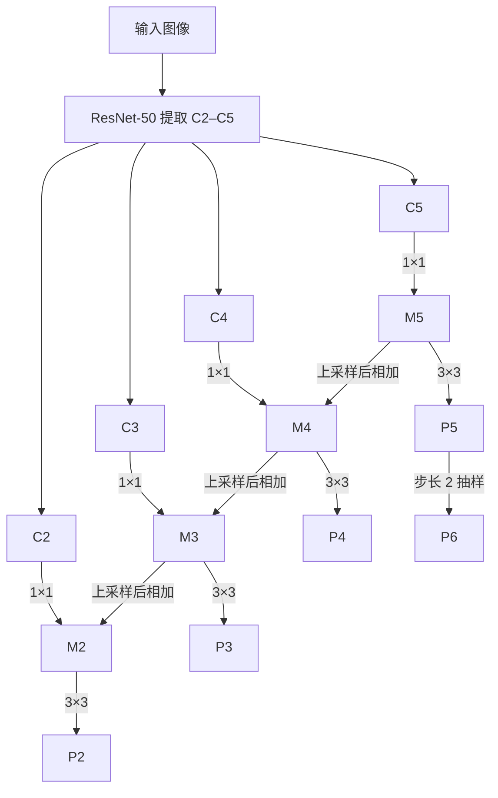

# Feature Pyramid Networks for Object Detection（FPN）

## 论文信息

| 项目 | 内容 |
| --- | --- |
| 标题 | Feature Pyramid Networks for Object Detection |
| 作者 | Tsung-Yi Lin、Piotr Dollár、Ross Girshick、Kaiming He、Bharath Hariharan、Serge Belongie |
| 会议 / 年份 | CVPR 2017 |
| 论文 | [arXiv:1612.03144](https://arxiv.org/abs/1612.03144) · [PDF](https://arxiv.org/pdf/1612.03144) |

## 论文简介与核心思想

目标检测要识别大小差别很大的物体。分别把图像缩放成多个尺寸并各跑一次骨干网络，计算和显存开销大；直接使用 CNN 不同深度的输出，浅层虽然分辨率高，但语义较弱。FPN **只对输入图像做一次骨干网络前向计算**，再用自顶向下的特征传递和侧向连接，让各分辨率的特征图都有较强的语义。随后在金字塔的**各层分别预测**，而不是仅在最终一张高分辨率图上预测。

本论文以目标检测为主要应用：将 FPN 接入 RPN 和 Fast/Faster R-CNN，另讨论了实例分割候选区域。FPN 本身输出的是多尺度特征图，**不是直接输出像素级水体分割掩码的语义分割模型**；迁移到水体分割时还需要另接分割头。

## 整体结构



上图的“上采样后相加”指上一层特征最近邻上采样后，和当前层的 1×1 侧向特征**逐元素相加**；这里不是拼接。论文中 `C2/C3/C4/C5` 分别是 ResNet conv2/conv3/conv4/conv5 的最后一个残差块输出，相对于原图的步长依次是 `4/8/16/32`。`P2–P5` 与对应的 `C2–C5` 空间尺寸相同；`P2–P6` 分别进入同一个共享 RPN head，`P2–P5` 分别进入同一个共享 RoI 检测 head。`P6` 不进入 Fast R-CNN 的 RoI 池化。

### 各模块作用

| 模块 | 做什么 | `model.py` 对应位置 |
| --- | --- | --- |
| Bottom-up backbone | 从单张输入提取多分辨率 `C2–C5` | `ResNet50BottomUp` |
| Lateral 1×1 | 将各层通道投影到 `d=256`，保留浅层的定位信息 | `FeaturePyramid.lateral2` 至 `lateral5` |
| Top-down | 最近邻上采样，并与同分辨率的侧向特征相加 | `FeaturePyramid.forward` 中 `m5→m2` |
| Output 3×3 | 对各融合结果做卷积，减弱上采样带来的混叠 | `FeaturePyramid.output2` 至 `output5` |
| RPN head | 对 `P2–P6` 做 3×3 卷积，再用两个 1×1 卷积分支预测物体性与框偏移；所有层共享参数 | `SharedRPNHead` |
| RoI 层级分配与池化 | 依候选框尺寸选 `P2–P5`，池化为 7×7 | `assign_rois_to_levels`、`PyramidRoIPool` |
| Fast R-CNN head | 两层 1024 维全连接层，再预测类别和类别相关的框偏移；所有层共享参数 | `SharedFastRCNNHead` |

## 公式和对应的 PyTorch 运算

论文第 3 节的结构可写成下面几步；这是对文字描述的**记号化整理**，不是论文编号公式：

$$
M_5 = \operatorname{Conv}_{1\times1}(C_5),\qquad
M_k = \operatorname{Conv}_{1\times1}(C_k)
    + \operatorname{Upsample}_{\mathrm{nearest}}(M_{k+1}),\ k=4,3,2,
$$

$$
P_k = \operatorname{Conv}_{3\times3}(M_k),\ k=2,3,4,5.
$$

对应 `F.interpolate(m_next, size=c_k.shape[-2:], mode="nearest")`、张量的 `+`、`nn.Conv2d(..., kernel_size=3, padding=1)`。上采样指定目标空间尺寸，使奇数边长的特征也能相加；这是对论文“放大 2 倍”的工程化尺寸对齐。金字塔附加的 1×1 与 3×3 卷积**没有 BN 和非线性激活**，遵照论文第 3 节。

论文第 4.2 节**式 (1)** 是 RoI 的层级分配规则：

$$
k=\left\lfloor k_0+\log_2\left(\frac{\sqrt{wh}}{224}\right)\right\rfloor,
\qquad k_0=4.
$$

`w、h` 是候选框在**输入图像**上的宽高，224 是参照尺度。例如 `w=h=112` 时 `k=3`，取 `P3`；`w=h=224` 时取 `P4`。代码分别使用 `torch.sqrt`、`torch.log2`、`torch.floor`，并把结果限制在 Fast R-CNN 使用的 `2–5` 层。最后对该层调用 `torchvision.ops.roi_pool(..., output_size=(7, 7), spatial_scale=1/2**k)`，再恢复候选框原顺序。

RPN 使用各层不同大小的锚框：`P2/P3/P4/P5/P6` 的面积分别为 `32²/64²/128²/256²/512²` 个输入像素，每层的宽高比都是 `1:2、1:1、2:1`。因此共享的 RPN head 在每个位置对应 3 个锚框，返回 3 个物体性 logits 和 `3×4=12` 个回归数值。这些锚框尺度是**头部输出的解释规则**；参考实现不包含锚框生成、候选框解码或 NMS。

## Forward 数据流与 Tensor Shape

以 `images: [B, 3, 256, 256]`、ResNet-50、`d=256` 为例：

| 步骤 | 形状 |
| --- | --- |
| `C2` / `C3` / `C4` / `C5` | `[B,256,64,64]` / `[B,512,32,32]` / `[B,1024,16,16]` / `[B,2048,8,8]` |
| 侧向投影 `M5`，逐层融合 `M4/M3/M2` | `[B,256,8,8]` → `[B,256,16,16]` → `[B,256,32,32]` → `[B,256,64,64]` |
| `P2/P3/P4/P5/P6` | `[B,256,64,64]` / `[B,256,32,32]` / `[B,256,16,16]` / `[B,256,8,8]` / `[B,256,4,4]` |
| 第 `k` 层 RPN 输出 | 物体性 `[B,3,Hk,Wk]`；框偏移 `[B,12,Hk,Wk]` |
| `R` 个 RoI 的检测支路 | `[R,5]` → 选取 `P2–P5` → `[R,256,7,7]` → `[R,1024]` → 分类 `[R,K]`、框偏移 `[R,4K]` |

`[R,5]` 的每一行是 `(batch_index, x1, y1, x2, y2)`，`K` 是**包含背景类**的类别数。对任意输入边长，空间尺寸可能因骨干网络下采样取整而不严格等于 `H/2^k`；表中使用 256 像素方便观察。

一个最小的阅读示例（预训练参数使用论文的 ImageNet 方案）：

```python
import torch
from model import FPNDetectorReference

model = FPNDetectorReference(num_classes=81)  # COCO: 80 个前景类别 + 背景
images = torch.randn(1, 3, 256, 256)
rois = torch.tensor([[0, 16, 16, 128, 128]], dtype=torch.float32)
out = model(images, rois=rois)
print(out["pyramid"]["P2"].shape)       # [1, 256, 64, 64]
print(out["roi_levels"], out["class_logits"].shape)  # tensor([3]), torch.Size([1, 81])
```

运行这个示例需要兼容版本的 `torch`、`torchvision`，以及可用的 ImageNet 权重缓存或下载通道。仅检查随机初始化后的维度时，可传 `weights=None`；这与论文报告的预训练检测实验设置不同。

## 与经典方法的区别

- **输入图像金字塔**：每个图像尺度分别做一次特征提取；FPN 只提取一次骨干特征，再在网络内部构建各尺度的强语义特征。
- **仅用骨干网络原始多层特征**：浅层的定位细节丰富但语义较弱；FPN 通过自顶向下路径传递深层语义，再加入侧向的定位细节。
- **U-Net 类的单张高分辨率输出**：两者都有跨尺度连接，但本文的检测头在多个 `Pk` 上分别作预测，RoI 也按尺寸路由到不同层；它不直接生成分割掩码。

论文消融实验在 COCO minival 上，ResNet-50 的 FPN RPN 的 `AR1k=56.3`，单用 `C4` 的 RPN 为 `48.3`（论文表 1）；完整 Faster R-CNN 的 `AP=33.9`，同论文的 `C4` 基线为 `31.6`（表 3）。这些数值来自论文，不是此参考代码的复现实测值。

## 论文明确内容与实现补全

| 项目 | 来源和选择 |
| --- | --- |
| `C2–C5`、最近邻上采样、1×1 相加、3×3 输出、256 通道、附加卷积无激活 | 论文 §3 明确给出 |
| RPN 使用 `P2–P6`、三个宽高比、各层共享 head；RoI 仅用 `P2–P5`、式 (1)、7×7 池化与两个 1024 维 FC | 论文 §4.1–4.2 明确给出 |
| `torchvision.models.resnet50` 提供 ResNet-50 实际残差块，默认加载 ImageNet 权重 | 论文实验用 ImageNet 预训练 ResNet-50；**调用 torchvision 是工程选择**，未重写另一篇 ResNet 论文 |
| 用输出尺寸而非固定 `scale_factor=2` 做最近邻上采样；`P6` 用 `::2` 取样 | **具体 PyTorch 实现选择**；对齐论文描述的同尺寸相加与步长 2 下采样 |
| RPN 3×3 后 `ReLU`；每个锚框一个二元物体性 logit；回归分支每框 4 个数 | **参考常规 RPN 的合理补全**；论文没有详细给出这几处激活与 logits 编码 |
| 分类维度 `K` 包含背景，回归维度 `4K`（背景的回归项可不用）；RoI 结果限制在 `P2–P5` | **常见 Fast R-CNN 的具体张量编码与边界处理**；论文未明确指定张量排列及越界操作 |

`forward(images, rois=None)` 中，RPN 各层 logits/框偏移始终被计算；给出外部 RoI 时才运行 Fast R-CNN 支路。论文没有在 FPN 部分详述完整的锚框生成、RPN loss/筛选、框解码、NMS、检测 loss 与训练循环；这些属于检测系统的额外工程步骤，**不能直接把这个参考实现当成开箱即用的 Faster R-CNN 训练程序**。

## 阅读心得

FPN 的关键不在于堆叠复杂模块，而在于让不同尺度都具备足够的语义，同时保留浅层的位置细节，并让检测头在多个尺度重复使用。同样的思想也能帮助理解医学和遥感图像分割网络中的跨尺度融合，但把 FPN 用于像素级水体分割时，应明确设计输出到原图大小的分割头及相应的监督方式。

## 文件结构

```text
FPN/
├── README.md   # 论文信息、数据流、公式、形状及实现边界
└── model.py    # 自底向上、FPN、共享 RPN、RoI 池化、共享 Fast R-CNN 参考实现
```
