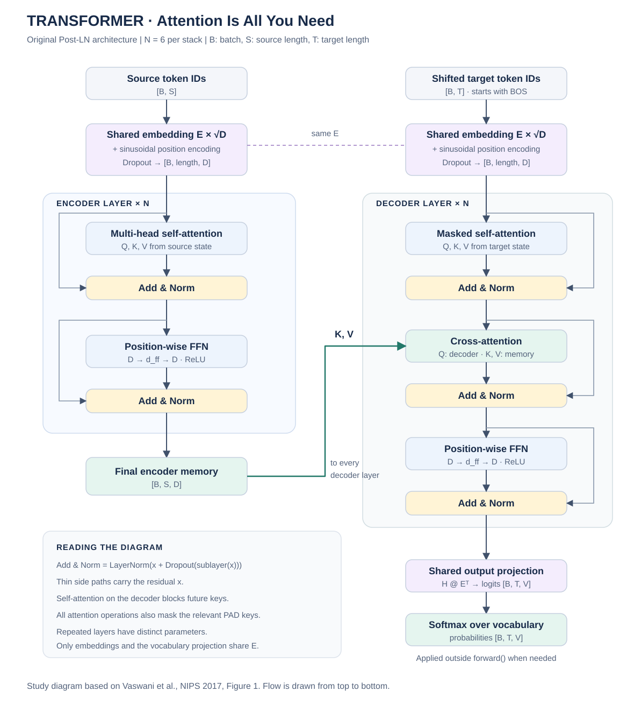

# Attention Is All You Need（Transformer）

## 1. 论文信息与实现范围

| 项目 | 内容 |
| --- | --- |
| 标题 | Attention Is All You Need |
| 作者 | Ashish Vaswani、Noam Shazeer、Niki Parmar、Jakob Uszkoreit、Llion Jones、Aidan N. Gomez、Łukasz Kaiser、Illia Polosukhin |
| 会议 / 年份 | NIPS 2017，现称 NeurIPS |
| 论文 | [arXiv:1706.03762](https://arxiv.org/abs/1706.03762) · [本次对应版本 v7](https://arxiv.org/abs/1706.03762v7) · [会议页面](https://papers.nips.cc/paper/7181-attention-is-all-you-need) |
| 原作者代码入口 | [Tensor2Tensor](https://github.com/tensorflow/tensor2tensor)，不是本目录代码的依赖 |
| 阅读依据 | 用户提供的 `Transformer.pdf`：arXiv v7，页边标注 2023-08-02；论文发表年份仍是 2017 |

这是用于**对照论文理解模型**的 PyTorch 参考实现。实现完整的文本 Encoder–Decoder Transformer，展开 Q/K/V 投影、多头拆分、缩放点积、掩码、softmax、对 V 加权、拼接、输出投影、FFN 和残差归一化。没有调用 `nn.Transformer`、`nn.MultiheadAttention` 或融合注意力接口。

实现以 §3 的主体模型、§5 的必要计算为重点，保留原论文的 **Post-LN、ReLU、正弦位置编码和三处权重共享**。不包含数据集、分词器、训练循环、checkpoint 平均或 beam search，也不声称复现了论文的 BLEU 指标。所有参数从初始化开始，没有加载预训练权重。

## 2. 论文简介与核心思想

传统 RNN/LSTM 翻译模型需要沿序列逐步计算隐藏状态，训练时难以同时处理一句话的全部位置。卷积模型可以并行，但远距离 token 之间的信息交互通常需要经过多层传播。

Transformer 用注意力直接建立位置之间的联系：

1. **Self-Attention**：每个位置根据内容，决定应该从同一序列的哪些位置读取信息。
2. **Multi-Head**：不同投影让多个头在不同特征子空间中建模关系。
3. **Positional Encoding**：显式加入位置，因为单纯的自注意力并不自带序列顺序。
4. **Encoder–Decoder Attention**：解码器根据目标语言的当前状态，查询编码器对源句子的表示。
5. **Causal Mask + 目标右移**：训练时可并行计算目标位置，同时避免读取要预测的答案或未来答案。

“Attention Is All You Need”不代表网络只有注意力层：FFN、Embedding、位置编码、残差连接、LayerNorm、输出投影也都是模型的重要组成部分。

## 3. 整体结构



图中一个 Encoder 层包含两个子层，一个 Decoder 层包含三个子层。每个子层之后都执行 `LayerNorm(x + Dropout(Sublayer(x)))`。标为重复 `N` 次的层**结构相同、参数不同**；所有 Decoder 层读取同一个最终 Encoder memory，但各自的交叉注意力投影参数不同。

| 超参数 | Base（代码默认） | Big（论文 Table 3） |
| --- | --- | --- |
| Encoder 层数 / Decoder 层数 | 6 / 6 | 6 / 6 |
| `d_model` | 512 | 1024 |
| `d_ff` | 2048 | 4096 |
| 头数 `h` | 8 | 16 |
| 每头 `d_k = d_v` | 64 | 64 |
| 残差与 embedding dropout | 0.1 | 0.3 |
| 标签平滑 `ε_ls` | 0.1 | 0.1 |

Big 的英法翻译实验使用 dropout=0.1，这是 §6.1 的例外。本实现的 `num_layers` 同时控制两侧层数；`d_model` 为偶数且能被 `num_heads` 整除。这里实现 Base/Big 的 `d_k=d_v=d_model/h`，没有为 Table 3 中独立改变 `d_k` 的消融配置添加接口。

## 4. 模块职责与阅读顺序

| 模块 | 位置 | 作用 |
| --- | --- | --- |
| `SinusoidalPositionalEncoding` | `blocks.py` | 生成 sin/cos 位置编码并与 embedding 相加 |
| `MultiHeadAttention` | `blocks.py` | 完整展开多头注意力，返回输出及每个头的注意力概率 |
| `PositionwiseFeedForward` | `blocks.py` | 每个 token 独立通过 Linear → ReLU → Linear |
| `EncoderLayer` | `blocks.py` | Self-Attention → Add & Norm → FFN → Add & Norm |
| `DecoderLayer` | `blocks.py` | Masked Self-Attention → Cross-Attention → FFN，每步都有 Add & Norm |
| `Transformer` | `model.py` | 共享词嵌入、叠加各层、投影到词表 logits |
| `make_padding_mask` / `make_target_mask` | `utils.py` | 构造 PAD 掩码与目标因果掩码 |
| `label_smoothed_cross_entropy` | `utils.py` | 展开标签平滑损失，忽略 PAD 标签位置 |
| `transformer_learning_rate` | `utils.py` | 对应学习率公式 (3) |

建议先读 `MultiHeadAttention.forward`，再读两个 Layer，最后沿 `Transformer.forward → encode / decode` 跟踪数据流。

## 5. 公式与真实 PyTorch 运算

以下“公式 (1)/(2)/(3)”沿用论文编号，其余公式是论文中未编号的表达式，或为解释代码补充的等价写法。

### 5.1 Scaled Dot-Product Attention：论文公式 (1)

$$
\operatorname{Attention}(Q,K,V)
=\operatorname{softmax}\left(\frac{QK^\top}{\sqrt{d_k}}\right)V.
$$

在有掩码时，先把不允许的 score 设为 $-\infty$，再 softmax：

```python
scores = torch.matmul(q, k.transpose(-2, -1))
scores = scores / math.sqrt(self.head_dim)
scores = scores.masked_fill(blocked_mask, float("-inf"))
attention_weights = F.softmax(scores, dim=-1)
context = torch.matmul(attention_weights, v)
```

这段展示默认 `attention_dropout=0.0` 的数学路径。完整实现保留了可选的注意力概率 dropout。

- `Q`：我希望查询什么；`K`：每个位置可用来匹配的特征；`V`：实际被加权读取的信息。
- `softmax(dim=-1)` 沿 **key 的位置**归一化，不能沿头维或 query 维归一化。
- $QK^\top$ 的结果是“query 位置 × key 位置”的关系矩阵。
- 除以 $\sqrt{d_k}$ 是为减弱大维度点积的幅度增长，避免 softmax 过度饱和。在分量独立、均值 0、方差 1 的理想假设下，点积方差为 $d_k$，缩放后为 1。
- 对 $V$ 的加权求和后，输出位置数等于 **query 的位置数**。

### 5.2 Multi-Head Attention：论文 §3.2.2

$$
\mathrm{head}_i=\operatorname{Attention}(QW_i^Q,KW_i^K,VW_i^V),
$$

$$
\operatorname{MultiHead}(Q,K,V)
=\operatorname{Concat}(\mathrm{head}_1,\ldots,\mathrm{head}_h)W^O.
$$

代码使用三个 `Linear(D, D, bias=False)` 一次计算所有头的 Q/K/V，再拆成 `h` 个头。这等价于沿输出特征维拼接 $W_1^Q,\ldots,W_h^Q$ 等矩阵，**不是把同一份 64 维向量复制 8 次**。

```python
q = self.q_projection(query)                      # [B, Lq, D]
q = q.reshape(B, Lq, h, d_k).transpose(1, 2)      # [B, h, Lq, d_k]
# K、V 同样拆分，完成 attention 后：
context = context.transpose(1, 2).contiguous()    # [B, Lq, h, d_v]
context = context.view(B, Lq, D)                 # [B, Lq, h*d_v]
output = self.output_projection(context)         # [B, Lq, D]
```

这是从实现中抽取的形状说明，`B/Lq/h/d_k/D` 对应实际的批量、长度与模块属性。`view` 合并最后两个维度等价于沿特征维拼接各头；不能直接对 `[B,h,Lq,d_v]` 调用 `view(B,Lq,D)`，否则 token 与头的排列关系会错。

PyTorch `nn.Linear` 的权重存储为 `[out_features, in_features]`，前向等价于 `x @ weight.T + bias`，所以存储形状与论文右乘矩阵的记号互为转置。

### 5.3 三种注意力的来源

| 位置 | Query 来源 | Key / Value 来源 | score 形状 | 掩码 |
| --- | --- | --- | --- | --- |
| Encoder Self-Attention | 本层输入源特征 | 同一源特征 | `[B,h,S,S]` | 源 PAD |
| Decoder Self-Attention | 本层输入目标特征 | 同一目标特征 | `[B,h,T,T]` | 目标 PAD + 未来位置 |
| Decoder Cross-Attention | 本层 masked self-attention 和 Add & Norm 的输出 | **最后一层 Encoder** 的 memory | `[B,h,T,S]` | 源 PAD |

Self-Attention 的三个**输入来源相同**，经过不同的权重投影后，Q/K/V 通常不同。Cross-Attention 的 Q 与 K/V 可以有不同序列长度；此处目标长度 `T` 不需要等于源长度 `S`。

### 5.4 FFN：论文公式 (2)

$$
\operatorname{FFN}(x)=\max(0,xW_1+b_1)W_2+b_2.
$$

```python
x = self.linear1(x)    # [B,L,512] -> [B,L,2048]
x = F.relu(x)
x = self.linear2(x)    # [B,L,2048] -> [B,L,512]
```

“Position-wise”表示同一层里各位置使用同一组参数，但分别计算。FFN 改变每个 token 的特征，不直接混合 token 位置；Attention 负责位置之间的信息交互。不同 Encoder/Decoder 层的 FFN 参数不共享。

### 5.5 Embedding 缩放与权重共享：论文 §3.4

设共享词嵌入矩阵 $E\in\mathbb{R}^{V\times D}$：

$$
X_\mathrm{src}=\sqrt D\,E[\mathrm{src}],\qquad
X_\mathrm{tgt}=\sqrt D\,E[\mathrm{tgt}],
$$

$$
\mathrm{logits}=H_\mathrm{decoder}E^\top,\qquad
p=\operatorname{softmax}(\mathrm{logits}).
$$

代码中的 `token_embedding` 在两侧复用，并执行：

```python
self.output_projection.weight = self.token_embedding.weight
```

三处共享的是**同一个 Parameter**。缩放只作用在 embedding 的查询结果上，不把共享权重原地乘大，也不额外缩放输出 logits。

这一方案要求源/目标使用**相同的词表及相同的 token-ID 含义**；仅词表大小相同不够。本实现只有一个 `vocab_size`，对应论文英德任务的共享词表设定，不提供独立双词表模式。

`forward` 返回 logits。论文图中的最终 softmax 仍有对应操作：推理需要概率时调用 `logits.softmax(dim=-1)`；训练损失内部使用 `log_softmax`，无需先 softmax 一遍。

### 5.6 Sinusoidal Positional Encoding：论文 §3.5

$$
PE_{(pos,2i)}=\sin\left(pos/10000^{2i/D}\right),
\qquad
PE_{(pos,2i+1)}=\cos\left(pos/10000^{2i/D}\right).
$$

代码先计算 $10000^{-2i/D}$，然后与位置相乘：

```python
inverse_frequency = torch.exp(
    torch.arange(0, D, 2, dtype=torch.float32) * (-math.log(10000.0) / D)
)
angles = position * inverse_frequency
pe[:, 0::2] = torch.sin(angles)
pe[:, 1::2] = torch.cos(angles)
x = x + pe.unsqueeze(0)
```

位置从 0 开始；偶数通道使用 sin，奇数通道使用 cos。PE 与 embedding **相加，不是拼接**，因此维度仍是 `D`。频率通过 `register_buffer` 保存，随模型迁移设备，但不会被优化器学习。

本实现按当前序列长度动态生成位置编码。公式能为更长位置生成数值，并不等于模型一定能在未训练过的长序列上获得良好效果。

### 5.7 Residual、Dropout 与 Post-LN：论文 §3.1、§5.4

$$
y=\operatorname{LayerNorm}\bigl(x+\operatorname{Dropout}(\operatorname{Sublayer}(x))\bigr).
$$

执行顺序是 **子层 → dropout → 残差相加 → LayerNorm**。这是原论文的 Post-LN，不是常见后续变体中的 Pre-LN。

对 `[B,L,D]` 使用 `nn.LayerNorm(D)`，每个 token 独立沿最后的 `D` 维归一化，不沿 batch 或序列长度统计。辅助理解公式为：

$$
\mu=\frac1D\sum_j x_j,\quad
\sigma^2=\frac1D\sum_j(x_j-\mu)^2,\quad
\operatorname{LN}(x)=\gamma\odot\frac{x-\mu}{\sqrt{\sigma^2+\epsilon}}+\beta.
$$

代码直接使用真实的 `nn.LayerNorm`。数值稳定项 `eps=1e-5` 是本实现补全；最后一个 Encoder/Decoder 层已经完成归一化，栈末尾不再额外添加一个 LayerNorm。

### 5.8 学习率：论文公式 (3)

$$
\mathrm{lrate}=d_\mathrm{model}^{-0.5}
\min\left(\mathrm{step\_num}^{-0.5},
\mathrm{step\_num}\cdot\mathrm{warmup\_steps}^{-1.5}\right).
$$

对应 `transformer_learning_rate` 中的 `torch.minimum` 与 `pow(-0.5)`。步数从 **1** 开始；前 4000 步线性升高，之后按步数平方根的倒数衰减。论文使用 Adam：`betas=(0.9, 0.98), eps=1e-9`，这里仅保留公式，不加入优化器或训练循环。

### 5.9 标签平滑：论文 §5.4 与明确补全

论文给出 `ε_ls=0.1`。本实现采用下面的均匀混合约定：

$$
q_k=(1-\epsilon_\mathrm{ls})\mathbf{1}[k=y]+\frac{\epsilon_\mathrm{ls}}V,
\qquad L=-\sum_kq_k\log p_k.
$$

因此：

$$
L=(1-\epsilon_\mathrm{ls})(-\log p_y)
+\epsilon_\mathrm{ls}\left(-\frac1V\sum_k\log p_k\right).
$$

`utils.py` 使用 `F.log_softmax`、`gather` 和 `mean` 展开这一过程，再只对非 PAD 标签位置取平均。该约定与 PyTorch 的 `F.cross_entropy(..., label_smoothing=0.1)` 一致。

**实现补全**：平滑分布在整个 `V` 类上均匀分配，包含 PAD 类；PAD 标签位置本身不计算损失。论文没有明确这里的 PAD 分配细节，不能把这个选择当作对原训练代码的逐项复刻。

## 6. Mask 与“右移一位”如何配合

假设完整目标序列为 `[BOS, I, love, water, EOS]`：

| 位置 | 0 | 1 | 2 | 3 |
| --- | --- | --- | --- | --- |
| Decoder 输入 `target_full[:, :-1]` | BOS | I | love | water |
| 监督标签 `target_full[:, 1:]` | I | love | water | EOS |
| 允许看到的目标输入位置 | 0 | 0, 1 | 0, 1, 2 | 0, 1, 2, 3 |

主对角线允许关注：位置 2 的输入是 `love`，预测的是 `water`，关注当前位置并不会读到该位置的标签。若把未右移的目标答案直接作为输入，仅使用因果掩码仍然会泄漏答案。

`make_target_mask` 把两个布尔条件按位或：

```python
padding = target_input.eq(pad_id)[:, None, None, :]    # [B,1,1,T]
causal = torch.ones(T, T, dtype=torch.bool, device=target_input.device).triu(1)
target_mask = padding | causal[None, None, :, :]      # [B,1,T,T]
```

本目录始终使用 **True = 禁止关注**。它是本实现的接口约定，使用其他 PyTorch 注意力接口时应单独核对布尔 mask 语义，不能直接假定相同。

PAD mask 屏蔽的是 **key 的列**。PAD query 行仍可能产生非零输出；这不影响有效 token，因为 PAD key 在每层都被屏蔽，PAD 标签位置也不参与损失。

为保持阅读代码简洁，本实现约定：序列右填充；源序列至少一个非 PAD token；目标输入以非 PAD 的 BOS 开头；一个损失 batch 至少有一个非 PAD 标签。这样每行注意力至少有一个合法 key，避免整行 $-\infty$ 导致 softmax 产生 NaN。不支持直接把左填充数据当作同样输入使用，也未添加成套参数校验。

## 7. Forward 数据流与 Tensor Shape

记 `B` 为 batch size，`S` 为源长度，`T` 为右移后目标长度，`V` 为共享词表大小。以 `B=2,S=10,T=8,D=512,h=8,d_k=d_v=64` 为例：

| 步骤 | 形状 |
| --- | --- |
| 源 token IDs / 目标输入 IDs | `[2,10]` / `[2,8]`，dtype 为 `torch.long` |
| 两侧 embedding × √D + PE + dropout | `[2,10,512]` / `[2,8,512]` |
| Encoder 分头后的 Q/K/V | `[2,8,10,64]` |
| Encoder attention scores / weights | `[2,8,10,10]` |
| Encoder 每头 context → 拼头 → 输出投影 | `[2,8,10,64]` → `[2,10,512]` → `[2,10,512]` |
| Encoder FFN | `[2,10,512]` → `[2,10,2048]` → `[2,10,512]` |
| 6 层 Encoder 后的 memory | `[2,10,512]` |
| Decoder self-attention Q/K/V | `[2,8,8,64]` |
| Decoder self-attention scores | `[2,8,8,8]` |
| Cross-Attention Q | `[2,8,8,64]` |
| Cross-Attention K/V | `[2,8,10,64]` |
| Cross-Attention scores → context → 输出 | `[2,8,8,10]` → `[2,8,8,64]` → `[2,8,512]` |
| Decoder FFN | `[2,8,512]` → `[2,8,2048]` → `[2,8,512]` |
| 6 层 Decoder 后的 hidden | `[2,8,512]` |
| 共享输出投影 logits | `[2,8,V]` |
| `softmax(dim=-1)` / `argmax(dim=-1)` | 概率 `[2,8,V]` / 预测 token IDs `[2,8]` |

注意表中不同的 `8` 可能代表头数或目标长度，实际含义取决于维度位置。

### 最小前向与反向示例

从 **PaperStudy 仓库根目录**运行，使用包导入 `from Transformer import Transformer`，不要直接运行 `Transformer/model.py`。核心代码只依赖 PyTorch。

下面故意缩小为 `D=64,h=4,N=2,d_ff=128`，便于在 CPU 上理解数据流；它不是论文的 Base 配置：

```python
import torch
from Transformer import Transformer, label_smoothed_cross_entropy

torch.manual_seed(7)
model = Transformer(
    vocab_size=1000, d_model=64, num_heads=4,
    num_layers=2, d_ff=128, dropout=0.1, pad_id=0,
)

# 模型接收 token ID，使用 randint，而不是用于浮点特征的 randn。
source = torch.randint(3, 1000, (2, 10))
target_full = torch.randint(3, 1000, (2, 9))
target_full[:, 0] = 1        # 示例 BOS ID
target_full[:, -1] = 2       # 示例 EOS ID
target_input = target_full[:, :-1]   # [2,8]
labels = target_full[:, 1:]          # [2,8]

logits = model(source, target_input) # [2,8,1000]
loss = label_smoothed_cross_entropy(logits, labels, pad_id=0)
loss.backward()
print(logits.shape, loss.item())

# 结构切换为论文 Base / Big；词表实际大小由分词器决定。
# base = Transformer(vocab_size=37000)
# big = Transformer(
#     vocab_size=37000, d_model=1024, num_heads=16,
#     num_layers=6, d_ff=4096, dropout=0.3,
# )
```

37000 是论文英德共享词表的近似规模示例，不是此实现绑定的精确词表。ID 0/1/2 的 PAD/BOS/EOS 含义也是示例约定，真实数据应与分词器保持一致。

### 自回归推理的一步

训练时，右移的真实目标序列已知，可同时计算所有目标位置；推理时，下一个 token 尚未知，需要生成后再接回前缀。对一个无 PAD 的目标前缀：

```python
model.eval()
prefix = torch.tensor([[1]], dtype=torch.long)  # 单条样本，只有 BOS
with torch.no_grad():
    logits = model(source[:1], prefix)
    next_probabilities = logits[:, -1, :].softmax(dim=-1)  # [1,V]
    next_id = next_probabilities.argmax(dim=-1, keepdim=True)
    prefix = torch.cat([prefix, next_id], dim=1)
```

这里仅展示一次贪心选 token，不是论文的 beam search；随机初始化模型的 token 没有翻译意义。实际循环可先调用 `encode` 复用 memory；KV cache 不是本实现范围。论文机器翻译使用 beam size=4、长度惩罚 α=0.6，以及 checkpoint 平均，这些评估细节不能由结构前向检查替代。

## 8. 论文明确规定与实现补全

| 项目 | 本目录选择 | 与论文的关系 |
| --- | --- | --- |
| 编码器/解码器各 6 层、Base 维度、8 头 | 默认采用 | §3.1–§3.3 明确给定 |
| Norm 与残差顺序 | Post-LN，无栈末额外 Norm | §3.1 明确给定 |
| FFN 激活 | ReLU，两层 Linear 带 bias | 公式 (2) 明确给定 |
| 注意力 Q/K/V 与输出投影 | 不带 bias | 按 §3.2.2 仅含权重矩阵的公式实现；不是断言所有官方代码版本都无 bias |
| 最终词表投影 bias | 不使用 | §3.4 未明确；本实现选择最小的共享矩阵投影 |
| 源/目标 embedding 与输出权重 | 同一张参数表 | §3.4 明确描述共享，要求共享词表语义 |
| 位置编码 | 固定 sin/cos，动态生成长度 | sin/cos 公式明确；动态生成是工程安排 |
| 残差、embedding dropout | Base 0.1 | §5.4 明确规定位置与比例 |
| 注意力概率 dropout | 可选，默认 0.0 | 主体公式未包含；§6.3 提及 attention dropout，但未完整规定机器翻译的这一设置，故不暗中假定比例 |
| FFN 中间 ReLU 后 dropout | 不额外添加 | 保持公式 (2)；仍在整个 FFN 输出处执行 residual dropout |
| LayerNorm eps | 1e-5 | 论文未给出该数值，采用 PyTorch 默认值 |
| 初始化 | Embedding 正态 std=D^-0.5；非共享 Linear Xavier uniform；bias=0 | 合理补全，不是论文完整指定的初始化方案 |
| PAD 与右填充、BOS/EOS ID | 显式约定并在例子中演示 | 工程输入约定；论文未提供这些 ID 的接口规范 |
| 标签平滑 | 全 V 类均匀混合，忽略 PAD 标签行 | ε=0.1 来自论文；PAD 类分配及平均方式明确补全 |
| 返回 logits | 外部按需 softmax | 数值接口安排；损失中显式 log-softmax 保留对应概率计算 |
| 训练/评估工程 | 不提供完整实验 | 未复现数据准备、步数、beam search、BLEU 和 checkpoint 平均 |

## 9. 与经典方法及视觉分割网络的区别

| 对比项 | 经典方法 | 原始 Transformer |
| --- | --- | --- |
| RNN/LSTM 序列建模 | 沿时间逐步传递隐藏状态 | Self-Attention 可在一个训练样本内并行处理各位置 |
| CNN 序列建模 | 局部窗口连接，远处依赖需多层传播 | 全局注意力单层可连接任意两个有效位置 |
| RNN Seq2Seq + Attention | 注意力通常辅助循环编码器/解码器 | 主体不依赖循环或卷积，注意力是主要位置交互方式 |
| U-Net 的 Encoder/Decoder | 常通过空间下采样/上采样形成多尺度特征 | 原论文保持源长度 S、目标长度 T 和特征宽度 D；没有 U 形空间缩放 |
| ViT 的输入 | 图像 patch 被转换为 token 特征 | 本论文的输入是离散文本 token ID，不是图像 patch |
| 仅有 decoder 的语言模型 | 通常没有独立源编码器和 encoder-decoder cross-attention | 本论文包含完整的 Encoder 与 Decoder 两个栈 |

论文 Table 1 的 Self-Attention 位置交互复杂度为 $O(n^2d)$，顺序操作数与最大位置连接路径为 $O(1)$；RNN 需要 $O(n)$ 个顺序步骤。这里描述的是单层内的依赖关系，不表示整个模型只执行一次操作，也不表示自回归生成可以一次得到所有未知 token。

若计入 Q/K/V/输出投影，标准自注意力子层还包含 $O(nd^2)$ 的代价；FFN 还有 $O(nd\,d_\mathrm{ff})$。本参考实现显式保存 $[B,h,n,n]$ 注意力矩阵，长序列的注意力内存呈二次增长。

迁移到水体分割时，可以把图像变成 patch/token 特征，并设计像素预测及恢复空间分辨率的模块；**当前代码本身是文本模型，不能直接输入 `[B,3,H,W]` 并输出水体 mask**。

## 10. 阅读心得

- 学习时先分清“位置之间的信息交互”和“单个位置内部的特征变换”：前者主要由 Attention 完成，后者主要由 FFN 完成。
- 结构看起来重复，但每层拥有独立参数；多层叠加能在前一层的关系表示上继续建模。
- Mask、目标右移和 Q/K/V 来源比模块命名更关键。形状正确不代表模型没有读取未来答案。
- 原论文的创新是一套可以并行训练的完整序列建模架构；后续 Pre-LN、GELU、RoPE 等设计不应被不加说明地写回这份原始论文实现。

## 11. 文件结构

| 路径 | 内容 |
| --- | --- |
| `README.md` | 论文信息、公式、形状、数据流、实现边界与阅读心得 |
| `blocks.py` | 位置编码、显式多头注意力、FFN、Encoder/Decoder 层 |
| `model.py` | 完整模型、共享权重、初始化与 forward |
| `utils.py` | 掩码、标签平滑和学习率公式 |
| `__init__.py` | 包导出，支持从仓库根目录导入 |
| `figures/architecture.svg` | 为本笔记绘制的结构图，依据论文 Figure 1 重述数据流 |

## 12. 本次检查记录

在 PyTorch `2.14.0+cpu` 下通过 9 组检查，包括：

- 与原生 `nn.MultiheadAttention` 对照输出与逐头注意力概率；与原生 Post-LN Encoder/Decoder 层对照数值。
- 验证改变未来目标 token 不影响前面位置的预测，追加右侧 PAD 不改变原有效数据流，并检查权重共享与层间参数独立。
- 与 `F.cross_entropy` 对照标签平滑损失，完成全模型反向传播并确认梯度有限；核对位置编码和学习率公式。
- 运行默认 Base 的前向传播，以及 README 中缩小模型的前向/反向和下一 token 示例。

这些检查验证实现与数据流，不代表完成 WMT 训练或复现 BLEU。验证脚本属于本次临时检查，本目录保留学习实现和笔记。

## 13. 参考资料

- [Attention Is All You Need, arXiv v7](https://arxiv.org/abs/1706.03762v7)：本次上传论文对应版本；§3 架构，§5 训练设置，§6 实验。
- [NIPS 2017 会议页面](https://papers.nips.cc/paper/7181-attention-is-all-you-need)：作者、会议与发表年份。页面摘要与上传版本的结果表述有版本差异，本笔记不将其混作同一实验记录。
- [PyTorch LayerNorm](https://docs.pytorch.org/docs/stable/generated/torch.nn.LayerNorm.html)：归一化维度、eps 与方差约定。
- [PyTorch cross_entropy](https://docs.pytorch.org/docs/stable/generated/torch.nn.functional.cross_entropy.html)：logits、ignore_index 与 label_smoothing 接口。
